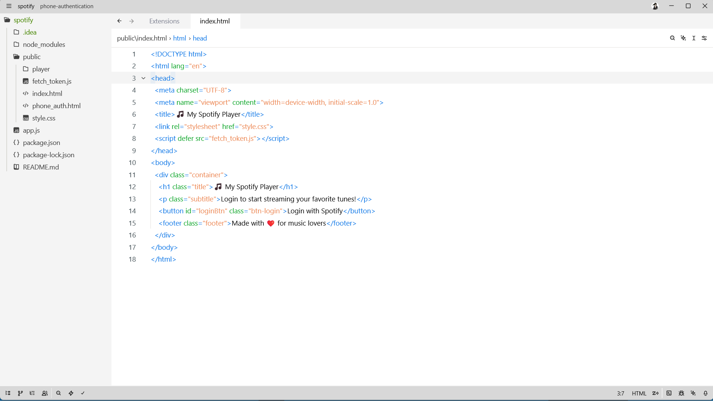
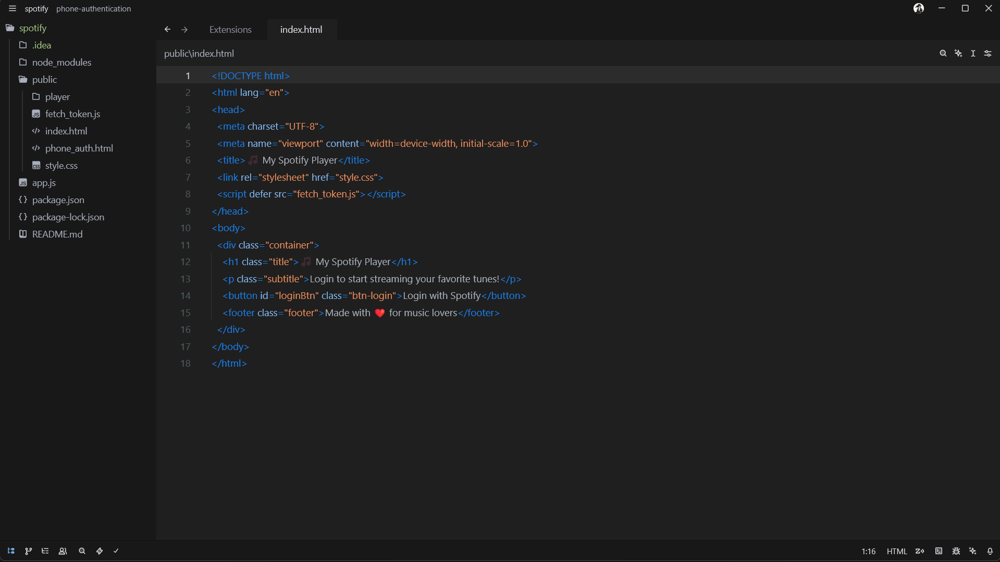

# DWP theme for zed editor
DWP = Designed with perfection in mind.

My main focus while creating this theme was to create a theme that is both visually appealing and easy to use.

As you can see in the preview below, the header footer and panel of IDE are kept of same accent colors so that main focus can be given to the editor area.

If you have any suggestion pls feel free to reach out to me or raise a PR

## Preview

Light theme will look like this:

Dark theme will look like this:

