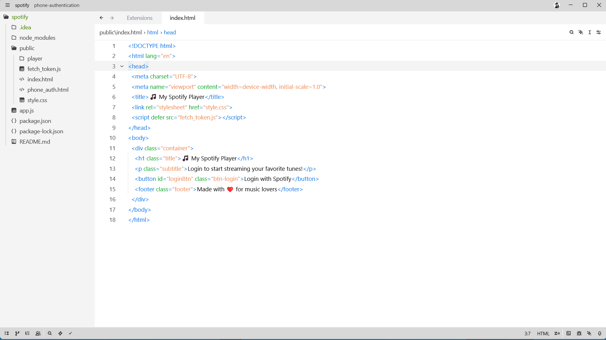
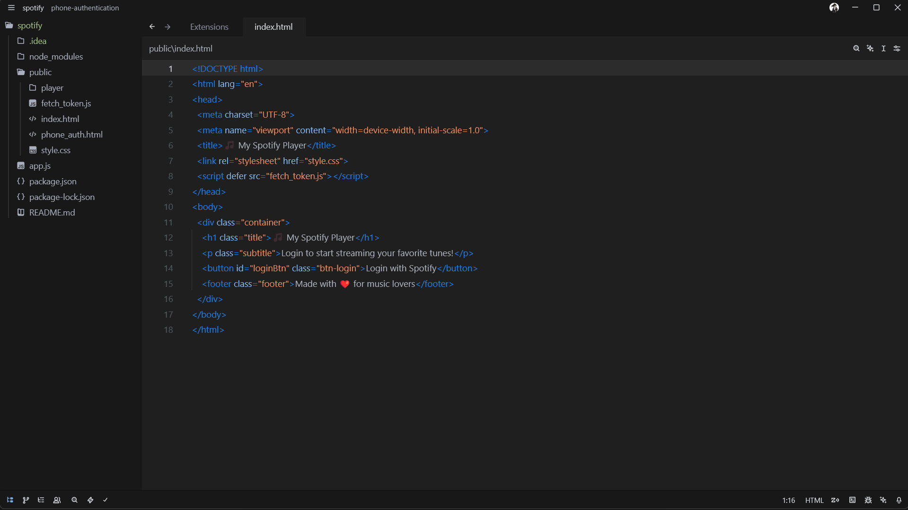

# DWP theme for zed editor
DWP = Designed with perfection in mind.

[Get it on the Zed extension marketplace](https://zed.dev/extensions/dwp)

My main focus while creating this theme was to create a theme that is both visually appealing and easy to use.

The header, footer, and panels share a single accent color by design: giving chrome its own competing colors pulls the eye away from the code, so everything around the editor stays quiet and the editor area is where the contrast lives. You can see this in the preview below.

If you have any suggestions, feel free to reach out to me or raise a PR.

## Preview

Light theme will look like this:

Dark theme will look like this:

